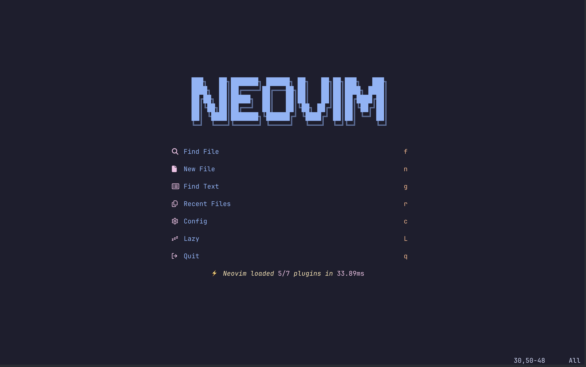

# nvim-config



## Neovim Configuration

Welcome to my Neovim configuration repository! This repository contains the configuration files for my Neovim setup, including plugins, key mappings, and other customisations.

## Installation

1. Make sure you have Neovim installed on your system.

```bash
brew install neovim
```

2. Download and install a Nerd Font from [here](https://www.nerdfonts.com/font-downloads) such as [FiraCode Nerd Font](https://github.com/ryanoasis/nerd-fonts/releases/download/v3.1.1/FiraCode.zip)

3. Clone this repository to your Neovim configuration directory. Typically, this directory is `~/.config/nvim` on Unix-based systems.

```bash
git clone https://github.com/thomaschaplin/nvim-config.git ~/.config/nvim
```

## Plugins

To see which plugins I'm using, take a look in the [lua/plugins](lua/plugins) directory!

## Theme

- [catppuccin/nvim](https://github.com/catppuccin/nvim)

## Architecture

This Neovim configuration follows a modular structure for organisation and maintainability. At the heart of the configuration is `init.lua`, serving as the main entry point. It orchestrates the loading of various components housed within sub-folders.

### Structure Overview

```
.
├── README.md
├── images
│   └── alpha-dashboard.png
├── init.lua
├── lazy-lock.json
└── lua
    ├── plugins
    │   ├── plugin-one.lua
    │   └── plugin-two.lua
    ├── tools
    │   ├── tool-one.lua
    │   ├── tool-two.lua
    │   └── init.lua
    └── user
        ├── init.lua
        ├── lazy.lua
        └── options.lua
```

### Details
`init.lua`: This file serves as the primary configuration entry point. It loads essential components and initializes the configuration.

`lua/plugins`: This directory houses individual Lua files, each dedicated to configuring a specific plugin. This separation facilitates clarity and ease of management.

`lua/tools`: Tools and utility functions reside in this directory. Each tool is encapsulated within its own Lua file, promoting modular design principles.

`lua/user`: User-specific configurations, such as keybindings and personalized settings, are stored here. The init.lua file in this directory orchestrates the loading of user configurations.

The architecture emphasizes cleanliness and isolation, promoting a structured and maintainable Neovim environment.
