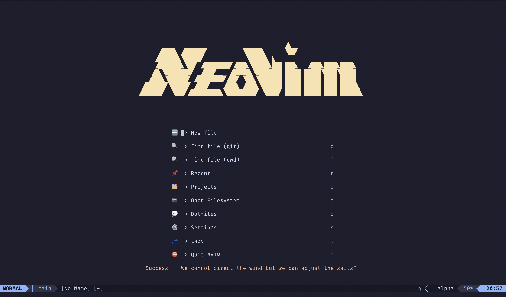

# nvim-config



# Neovim Configuration

Welcome to my Neovim configuration repository! This repository contains the configuration files for my Neovim setup, including plugins, key mappings, and other customisations.

## Installation

1. Make sure you have Neovim installed on your system.

```bash
brew install neovim
```

2. Clone this repository to your Neovim configuration directory. Typically, this directory is `~/.config/nvim` on Unix-based systems.

```bash
git clone https://github.com/thomaschaplin/nvim-config.git ~/.config/nvim
```

## Plugins

- [goolord/alpha-nvim](github.com/goolord/alpha-nvim)
- [windwp/nvim-autopairs](github.com/windwp/nvim-autopairs)
- [romgrk/barbar.nvim](github.com/romgrk/barbar.nvim)
- [hrsh7th/cmp-nvim-lsp](github.com/hrsh7th/cmp-nvim-lsp)
- [L3MON4D3/LuaSnip](github.com/L3MON4D3/LuaSnip)
- [hrsh7th/nvim-cmp](github.com/hrsh7th/nvim-cmp)
- [mfussenegger/nvim-dap](github.com/mfussenegger/nvim-dap)
- [tpope/vim-fugitive](github.com/tpope/vim-fugitive)
- [lewis6991/gitsigns.nvim](github.com/lewis6991/gitsigns.nvim)
- [williamboman/mason.nvim](github.com/williamboman/mason.nvim)
- [williamboman/mason-lspconfig.nvim](github.com/williamboman/mason-lspconfig.nvim)
- [neovim/nvim-lspconfig](github.com/neovim/nvim-lspconfig)
- [nvim-lualine/lualine.nvim](github.com/nvim-lualine/lualine.nvim)
- [nvim-neo-tree/neo-tree.nvim](github.com/nvim-neo-tree/neo-tree.nvim)
- [nvimtools/none-ls.nvim](github.com/nvimtools/none-ls.nvim)
- [nvim-telescope/telescope-ui-select.nvim](github.com/nvim-telescope/telescope-ui-select.nvim)
- [nvim-telescope/telescope.nvim](github.com/nvim-telescope/telescope.nvim)
- [akinsho/toggleterm.nvim](github.com/akinsho/toggleterm.nvim)
- [nvim-treesitter/nvim-treesitter](github.com/nvim-treesitter/nvim-treesitter)

## Theme

- [catppuccin/nvim](github.com/catppuccin/nvim)
